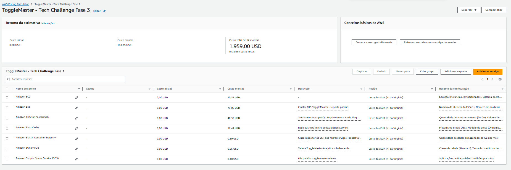

# Estimativa de Custos AWS

Estimativa elaborada no AWS Pricing Calculator para a arquitetura ToggleMaster na região **US East (N. Virginia)**, considerando execução contínua por aproximadamente 730 horas mensais e uma carga acadêmica pequena.

| Serviço | Configuração resumida | Estimativa mensal |
|---|---|---:|
| Amazon EC2 | 1 instância `t3.medium`, Linux, On-Demand | US$ 30,37 |
| Amazon EKS | 1 cluster em suporte padrão | US$ 73,00 |
| Amazon RDS for PostgreSQL | 3 instâncias `db.t3.micro`, Single-AZ, com 20 GB gp3 cada | US$ 46,32 |
| Amazon ElastiCache | 1 nó Redis `cache.t3.micro`, On-Demand | US$ 12,41 |
| Amazon ECR | 5 GB armazenados entre cinco repositórios | US$ 0,50 |
| Amazon DynamoDB | Tabela Standard sob demanda, carga acadêmica | US$ 0,25 |
| Amazon SQS | 1 milhão de solicitações mensais em fila padrão | US$ 0,40 |
| **Total estimado** |  | **US$ 163,25/mês** |

O custo projetado para doze meses é de **US$ 1.959,00**, sem custo inicial. Os valores são estimativas e podem variar conforme consumo, tráfego, retenção, impostos e alterações de preços da AWS.

Os maiores componentes são o plano de controle do EKS, os três bancos RDS, o node EC2 e o Redis. Em um cenário acadêmico, os recursos são destruídos após a validação e a entrega para interromper cobranças. Em produção, o custo pode ser otimizado com autoscaling, dimensionamento conforme métricas e modelos de compromisso de uso.

## Evidência

